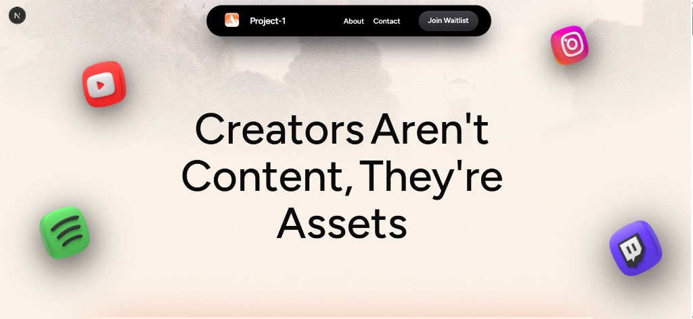

# Project-1

> **Creators Aren't Content, They're Assets**

Turn your favorite creators into investable tokens. Buy, sell, and grow with the creators you believe in.



## 🚀 Getting Started

### Prerequisites

- Node.js 18+ 
- npm or pnpm

### Installation

1. **Clone the repository**
   ```bash
   git clone https://github.com/Atharvsinh-codez/Project-1.git
   cd Project-1
   ```

2. **Install dependencies**
   ```bash
   npm install
   # or
   pnpm install
   ```

3. **Set up environment variables**
   ```bash
   cp .env.example .env
   ```
   Fill in the required environment variables.

4. **Run the development server**
   ```bash
   npm run dev
   ```

5. **Open in browser**
   ```
   http://localhost:3000
   ```

## 🛠️ Tech Stack

- **Framework**: Next.js 15
- **Styling**: Tailwind CSS
- **Animations**: Framer Motion + GSAP
- **Database**: PostgreSQL with Prisma
- **Authentication**: Custom email OTP

## 📁 Project Structure

```
├── app/                  # Next.js app router pages
├── components/           # React components
│   ├── landing-page/     # Landing page sections
│   ├── ui/               # Reusable UI components
│   └── onboarding/       # Creator onboarding flow
├── lib/                  # Utilities and helpers
├── prisma/               # Database schema
├── public/               # Static assets
└── services/             # API services
```

## 🔗 Links

- **Twitter**: [@athrix_codes](https://x.com/athrix_codes)
- **GitHub**: [Atharvsinh-codez/Project-1](https://github.com/Atharvsinh-codez/Project-1)

## 📄 License

This project is proprietary. All rights reserved.

---

Built with ❤️ by Atharv
